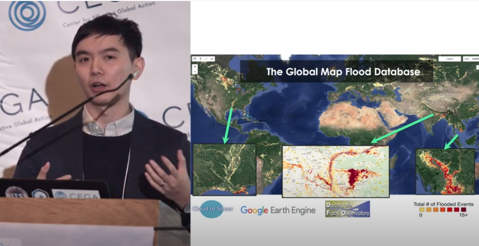

I presented on Cloud to Street's flood mapping work in the Republic of the Congo for the [2018 Geospatial Analysis for International Development Conference](https://cega.berkeley.edu/resource/satellite-based-flood-mapping-to-build-resilience-jeff-ho-geo4dev-2018/). You can watch the talk [here](https://www.youtube.com/watch?v=Dr8ORDNDtww).

