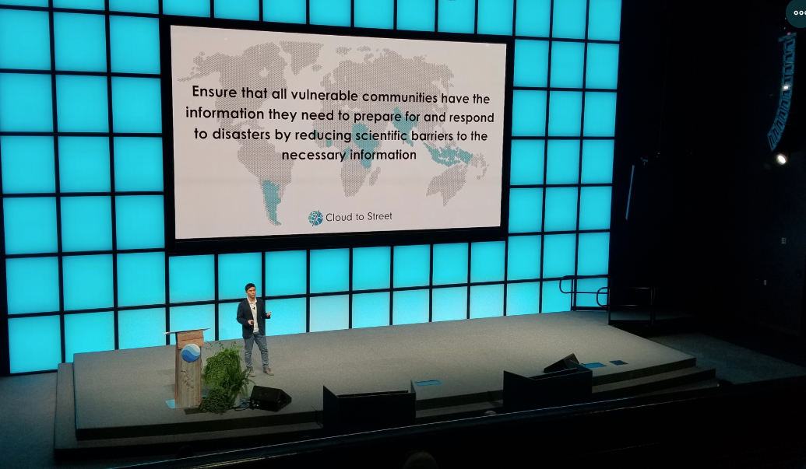

I gave a keynote at the [2019 Google Geo for Good summit](https://sites.google.com/earthoutreach.org/geoforgood19/home) as the Director of Science and Product for Cloud to Street. You can watch the talk [here](https://www.youtube.com/watch?v=1rjihO8xyLQ).

